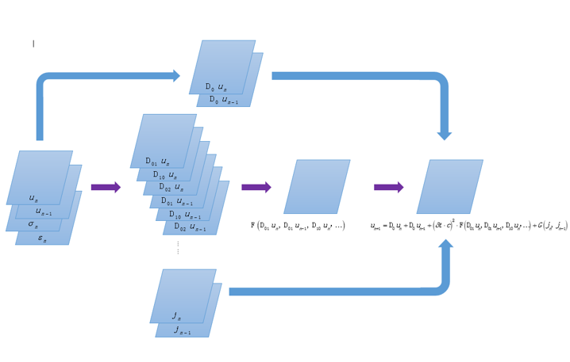
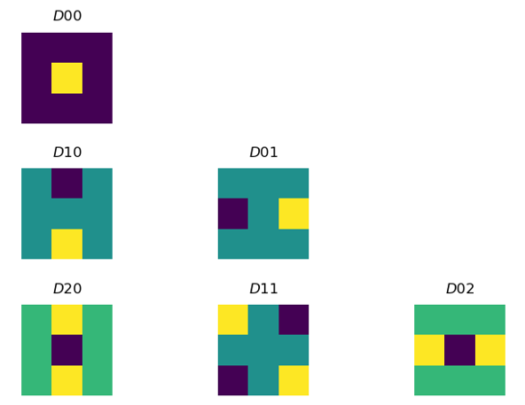

# PDE-Net-FDTD

## Introduction
Transient electromagnetic (EM) analysis is of critical importance in computational physics society.
Time-domain maxwell’s equations (ME) can be expressed as a group of partial differential
equations (PDEs) that are widely used in modeling all types of continous phenomena in nature.
In this literature, we propose an elaborately designed PDE-based linear neural network to predict
the transient dynamics of the Maxwell’s equations and build a direct mapping between the
dynamics of wave physics and the computation in artificial neural networks (ANN). Moreover,
the ANN can learn the specific differential operators used in the numerical ground truth PDE.
The proposed ANN architecture has no restriction on the simulation domain size and structure,
nor has limitation on the time duration. More importantly, it has extremely small size and
such good prediction results that the proposed NN solver can be used to replace the original
finite difference method in computational electromagnetics.

Machine learning (ML) and artificial neural network (NN) is rapidly emerging as a powerful tool
and a promising framework for solving complex problems in computational electromagnetics
(CEM). The works related to NN and CEM in the recent years are mostly exploratory and heuristic. The topics covered by the papers related to ML techniques in CEM society are mostly
carried out in inverse EM scattering[3][4][5][6], direction-of-arrival (DoA) estimation, radar and
remote sensing (RS), interconnect parasitic extraction[7], electrostatic sovler[8][9], transient EM
solver,[10][11][12][13], etc. Specifically, among the efforts made for transient field prediction,[10] used separately RNN utilizing tiled local information and CNN with convolutional layers, pooling
layers and fully-connected layers to recursively predicting the future 1 step with only one
previous step as input.[12] linked the 2D-FDTD method with NN using RCNN (a combination
of RNN for iterative process with time and CNN for feature extraction and reducing data size)
to transform CPU FDTD computation to GPU RCNN computation and applied the RCNN to
RCS analysis.[13] used a deep neural network containing encoder-decoder CNN, convolutional
LSTM[14] and Resnet[15].

Most of the work based on ML techniques in EM society have a profound relationship with
computer vision, we call them learning-based methods. Others[12] make use of only the neural
network architectures and have preset, fixed, unlearnable weights, we call them computationbased
methods. In this literature, we are inspired by both the learning-based and computationbased
methods and are going to bridging the gap between them. Because we believe a neatly
trained NN should have specific patterns in its learned weights and phisical or mathematical
meaning behind it.

## Work-flow
* 2D fdtd data generation 
* Dirichlet/PML boundary condition
* Choose proper constraints (size and order) on the filters with the "order of sum rule"
* Design the network stucture based on PDENet
* Train the network
* Run the network to predict FDM for some time range
* Add noise to the training data

## Figures

## Benefits
Can provide valuable insight for tuning parameters for other time domain PDE-based method.

Training method is similar to shooting in solving the ODEs, i.e., give an initial value and compare the predicted result with the final value predicted by PDE.

The foward procedure is set the weights of the convolutional kernels by hand and calculate the Mawell euqations (transformed ME) through neural network convolution instead of full matrix operation. By leveraging the GPU power provide by CUDA-based Pytorch, we can obeserve an computaional efficiency promotion in computing the Finite Difference method.

In ML based CEM, one criterion we should follow is that it's better to combine the traditional numerical methods with the recently booming neural network, which means we make use of as much prior knowledge as we can. Combing with the proved relationships between NN and ODE/PDE, we could design more promising and propelling neural network.

Capable of predicting extremely long time.

## References
[1] WIEWEL S, BECHER M, THUEREY N. Latent space physics: Towards learning the
temporal evolution of fluid flow[C]//Computer Graphics Forum: vol. 38: 2. [S.l. : s.n.],
2019: 71-82.

[2] HUGHES T W, WILLIAMSON I A, MINKOV M, et al. Wave physics as an analog
recurrent neural network[J]. Science advances, 2019, 5(12): eaay6946.

[3] WEI Z, CHEN X. Deep-learning schemes for full-wave nonlinear inverse scattering problems[
J]. IEEE Transactions on Geoscience and Remote Sensing, 2018, 57(4): 1849-1860.

[4] LI L, WANG L G, TEIXEIRA F L, et al. DeepNIS: Deep neural network for nonlinear
electromagnetic inverse scattering[J]. IEEE Transactions on Antennas and Propagation,
2018, 67(3): 1819-1825.

[5] LI L, WANG L G, TEIXEIRA F L. Performance analysis and dynamic evolution of deep
convolutional neural network for electromagnetic inverse scattering[J]. IEEE Antennas
and Wireless Propagation Letters, 2019, 18(11): 2259-2263.

[6] YAO H M, WEI E, JIANG L. Two-step enhanced deep learning approach for electromagnetic
inverse scattering problems[J]. IEEE Antennas and Wireless Propagation Letters,
2019, 18(11): 2254-2258.

[7] PRADIPTA G, CHHABRIA V A, SAPATNEKAR S S. A Machine Learning Based Parasitic
Extraction Tool[J].,

[8] TANG W, SHAN T, DANG X, et al. Study on a Poisson’s equation solver based on deep
learning technique[C]//2017 IEEE Electrical Design of Advanced Packaging and Systems
Symposium (EDAPS). [S.l. : s.n.], 2017: 1-3.

[9] SHAN T, DANG X, LI M, et al. Study on a 3D Possion’s Equation Slover Based on
Deep Learning Technique[C]//2018 IEEE International Conference on Computational
Electromagnetics (ICCEM). [S.l. : s.n.], 2018: 1-3.

[10] YAO H M, JIANG L J. Machine learning based neural network solving methods for the
FDTD method[C]//2018 IEEE International Symposium on Antennas and Propagation
& USNC/URSI National Radio Science Meeting. [S.l. : s.n.], 2018: 2321-2322.

[11] YAO H M, JIANG L. Machine-learning-based PML for the FDTD method[J]. IEEE
Antennas and Wireless Propagation Letters, 2018, 18(1): 192-196.

[12] GUO L, LI M, XU S, et al. Study on a Recurrent Convolutional Neural Network Based
FDTD Method[C]//2019 International Applied Computational Electromagnetics Society
Symposium-China (ACES): vol. 1. [S.l. : s.n.], 2019: 1-2.

[13] NOAKOASTEEN O, WANG S, PENG Z, et al. Physics-Informed Deep Neural Networks
for Transient Electromagnetic Analysis[J]. IEEE Open Journal of Antennas and Propagation,
2020, 1: 404-412.

[14] SHI X, CHEN Z, WANG H, et al. Convolutional LSTM network: A machine learning
approach for precipitation nowcasting[J]. Advances in neural information processing systems,
2015, 28: 802-810.

[15] HE K, ZHANG X, REN S, et al. Deep residual learning for image recognition[C]//
Proceedings of the IEEE conference on computer vision and pattern recognition. [S.l.
: s.n.], 2016: 770-778.

[16] WEINAN E. A proposal on machine learning via dynamical systems[J]. Communications
in Mathematics and Statistics, 2017, 5(1): 1-11.

[17] LU Y, ZHONG A, LI Q, et al. Beyond finite layer neural networks: Bridging deep architectures
and numerical differential equations[C]//International Conference on Machine
Learning. [S.l. : s.n.], 2018: 3276-3285.

[18] ZHANG X, LI Z, CHANGE LOY C, et al. Polynet: A pursuit of structural diversity in
very deep networks[C]//Proceedings of the IEEE Conference on Computer Vision and
Pattern Recognition. [S.l. : s.n.], 2017: 718-726.

[19] LARSSON G, MAIRE M, SHAKHNAROVICH G. Fractalnet: Ultra-deep neural networks
without residuals[J]. ArXiv preprint arXiv:1605.07648, 2016.

[20] GOMEZ A N, REN M, URTASUN R, et al. The reversible residual network: Backpropagation
without storing activations[J]. Advances in neural information processing systems,
2017, 30: 2214-2224.

[21] CAI J F, DONG B, OSHER S, et al. Image restoration: total variation, wavelet frames,
and beyond[J]. Journal of the American Mathematical Society, 2012, 25(4): 1033-1089.

[22] DONG B, JIANG Q, SHEN Z. Image restoration: Wavelet frame shrinkage, nonlinear
evolution pdes, and beyond[J]. Multiscale Modeling & Simulation, 2017, 15(1): 606-660.

[23] JIN J M. Theory and computation of electromagnetic fields[M]. [S.l.]: John Wiley & Sons,
2011.